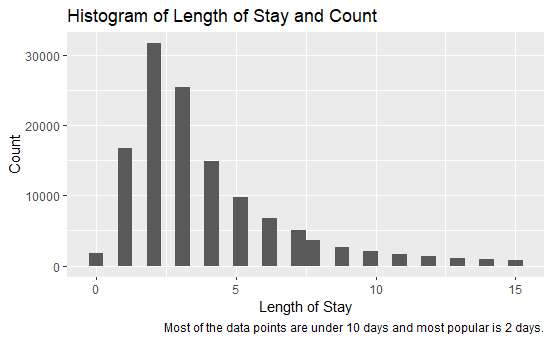
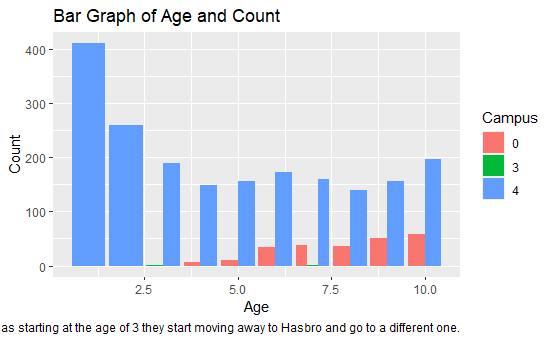
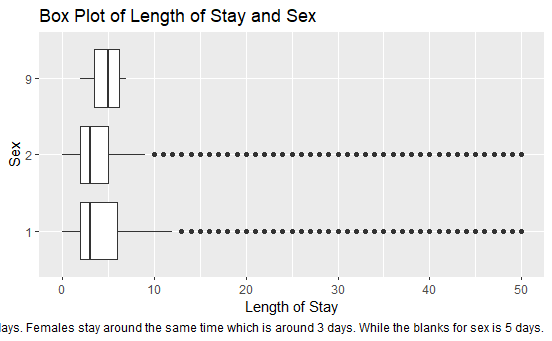
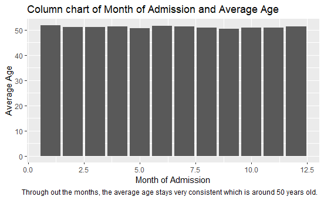
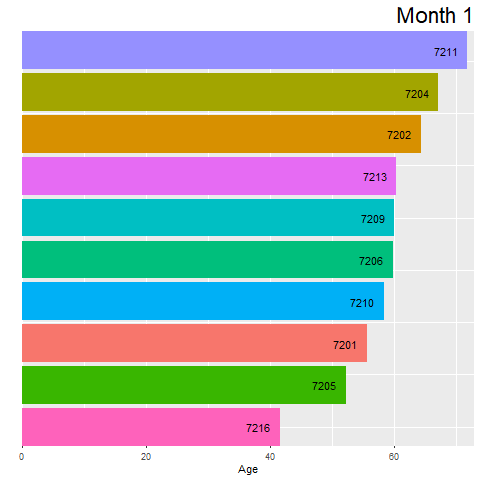
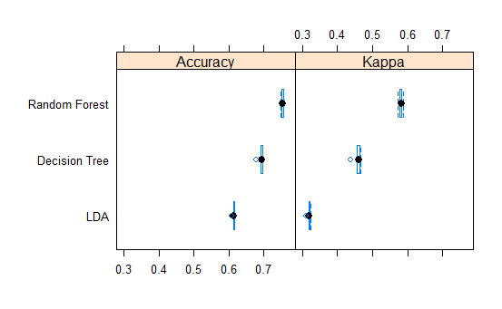
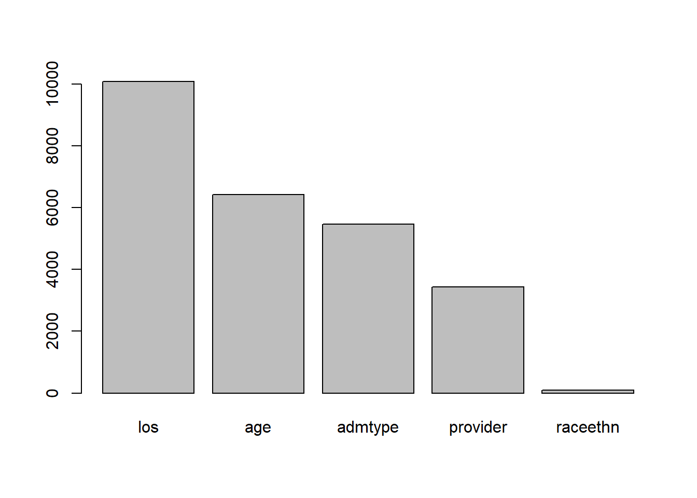
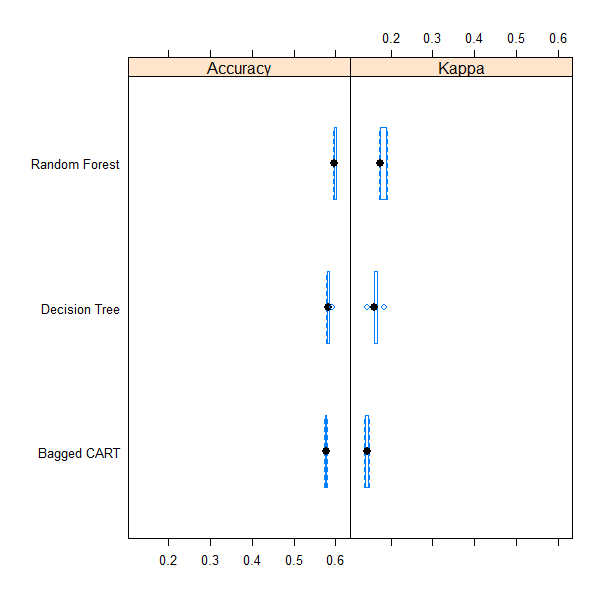
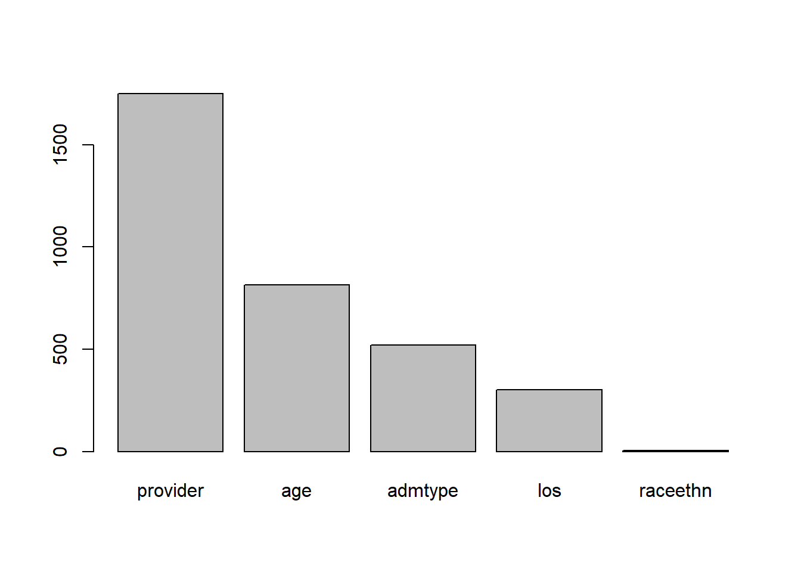

```{r setup, include=FALSE}
knitr::opts_chunk$set(echo = FALSE)
```


## Graphs
My first graph, I wanted to showcase the breakdown of the length of stay column. As you can see, most of the data points lye under 15 days. Most people cannot afford to do more than that so that this graph makes sense visually and mentally. 


## Graphs
The filter includes 10 but not 0. We can conclude that most of the little kids goes to campus 4, which is Hasbro Childrens hospital. If we do not filter out 0, most of the newborns go to one hospital which is Woman and infants.


## Graphs
This boxplot shows the exact distribution of where the data point lies for the variable Length of Stay and Sex for y-axis.


## Graphs
I wanted to see the average age of the patients based upon each month.


## Graphs
I wanted to showcase my bar race chart. As you can see, provider 7211 has the oldest people on a per monthly basis.  


## First model selection for predicting Total
Target Variable: Spread apart between low, medium and high total cost. Low was -Inf to 13,400 dollars. Medium was 13,400 to 37,000 dollars. Finally, high was above 37,000 dollars. 

## variable importance for decision tree


## Second model for predicting sex
The model that I chose was Random Forest. My target variable was sex. I took out the 9 value that used to be apart of my target variable. 

## variable importance for decision tree


## Errors/ challenges/ solutions part 1 that I ran into

I had simple errors that took all of 10 minutes to fix. By talking to the professor, I was able to fix them:

- How could I make my bar race chart more colorful for each of the columns?
- Why was one of my chart's keys not working that well? 
- How can I name my key something more meaningful than "factor(campus)"
- finding a model that would fit my second target variable which is sex

## Errors/ challenges/ solutions part 1 that I ran into

- Hard to understand the variables. Fortunately, I used the dictionary to helped me understand what they are and what values are in there. 
- The models took a very long time to run, just ran it at night. 
- It was very hard to make sure that all code was organized. Going from top to bottom is always tricky. 